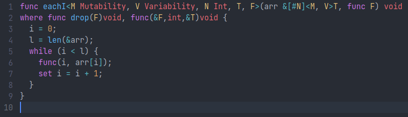

# lite-plugin-vale

A Lite and Lite-XL plugin providing syntax highlighting for the [Vale](https://vale.dev/) programming language.

*The code comes from [arrays implementation](https://github.com/ValeLang/Vale/blob/master/stdlib/src/arrays/arrays.vale).*

## Installation

Simply add the [language_vale.lua](language_vale.lua) file to the `plugins` directory and restart the editor.
